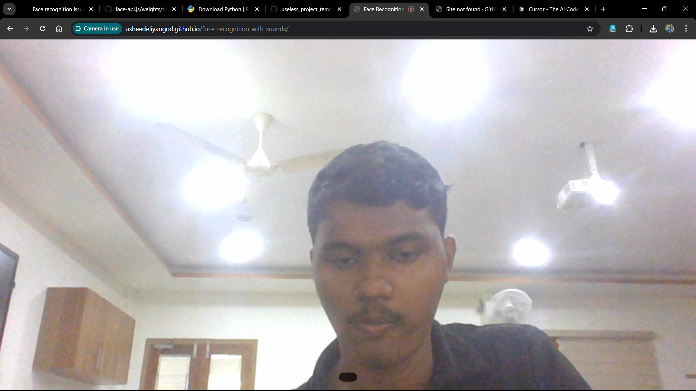
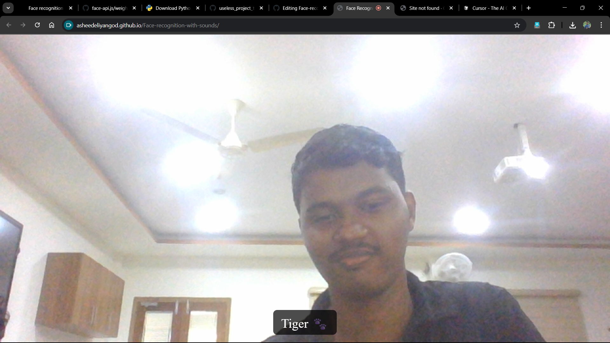
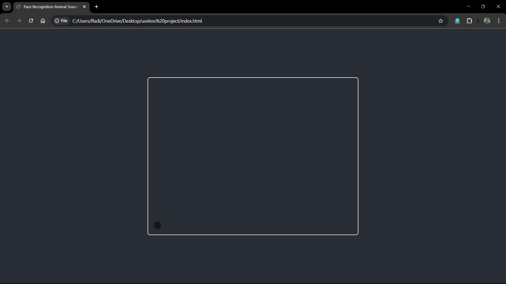

---
# 🎭 Face the Music 🎶
# Because every face deserves a theme song.

## Basic Details
## Team Name:
#### The Tone-Deaf Coders

## Team Members
Team Lead: Asheed Eliyangod — MAMO COLLEGE MANASSERY.

## Project Description
Face the Music is a gloriously pointless web app that:

Scans your face using your webcam 👀

Assigns you a signature sound 🎵

Remembers it until you refresh

Turns group hangouts into accidental soundboards

It’s like a doorbell… but for your face.

## The Problem (Nobody Asked to Solve)
Faces are boringly silent.
No moo, no beep, no applause.
Tragic.

## The Solution (Overengineered for Fun)
We use AI-powered face recognition to do the dumbest thing possible:

Detect your face

Pick a random sound effect

Play it every time you appear

Make everyone in the room uncomfortable (bonus points)

## Technical Details
## Technologies/Components Used
## For Software:

Languages: HTML, CSS, JavaScript

Library: face-api.js

Audio: The finest collection of random sounds from the depths of the internet

Tools: A webcam, Google Chrome, and questionable life choices

## For Hardware:

Webcam (the less HD, the funnier the results)

A computer with speakers or headphones

Infinite patience for testing your own face
## RUN
[live](https://asheedeliyangod.github.io/Face-recognition-with-sounds/)
## Implementation
### Installation

```
git [clone https://github.com/yourusername/face-the-music](https://github.com/AsheedEliyangod/Face-recognition-with-sounds)
cd face-the-music
Run Open index.html in your browser
```
Allow webcam access<br>

Watch chaos unfold<br>

## Project Documentation
### Features:
✅ Same face → same sound<br>
✅ Different face → different sound<br>
✅ Two people → awkward sound mashups<br>
✅ No actual purpose → ✅✅✅<br>

## Screenshots




## Demo Video


## Disclaimer
No feelings were harmed in the making of this app. Only ears.<br>
<br>
Made with ❤️ at TinkerHub Useless Projects 


